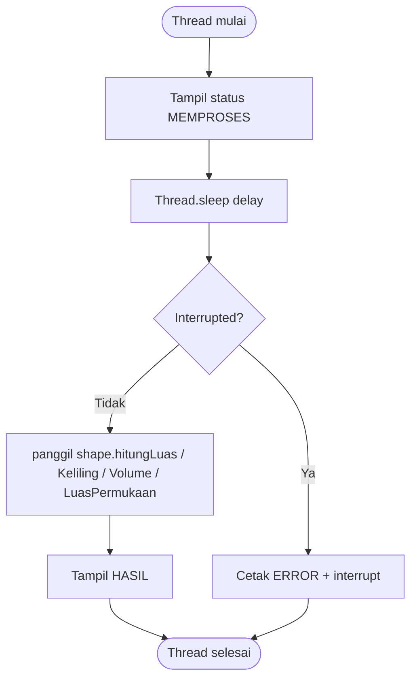
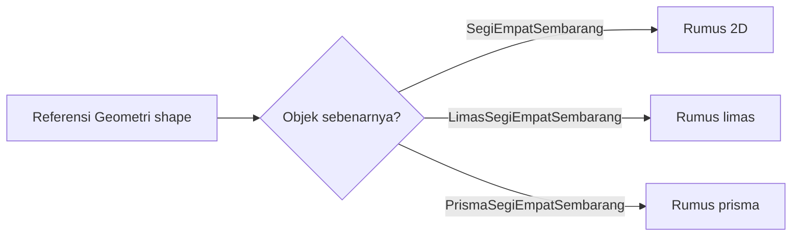
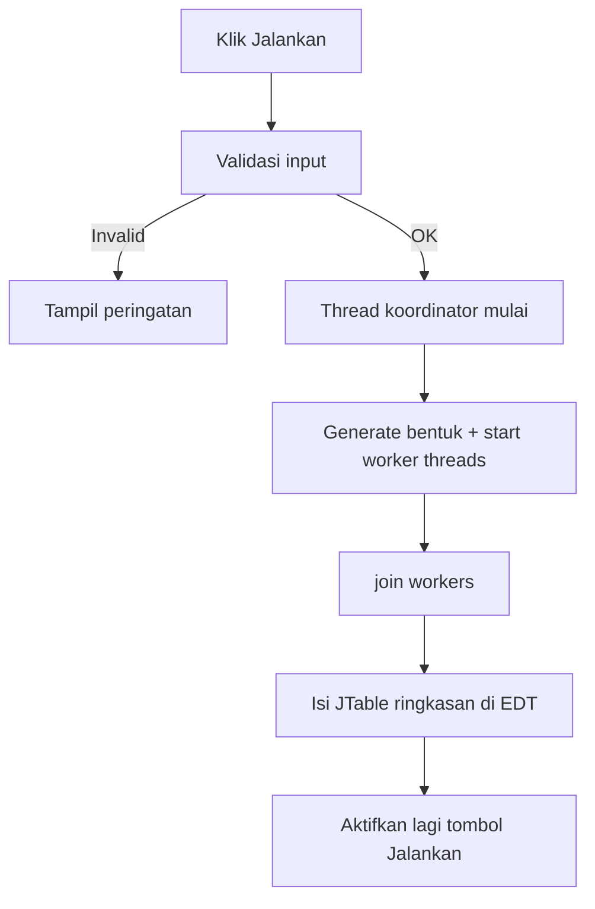

# Panduan presentasi — Proyek Geometri multithreading (Java)

**Lebih mudah dibuka di browser:** file `presentasi/index.html` (lihat juga `presentasi/baca-dulu.txt`). **Diagram Mermaid terpisah:** folder `presentasi/mermaid/` (diagram **01–05** berurutan, lalu **06** master di akhir). **Cara baca flowchart + simbol standar:** `presentasi/PENJELASAN_FLOWCHART_LENGKAP.md`. **Arti output:** `presentasi/PENJELASAN_OUTPUT_LENGKAP.md`.

Dokumen ini untuk **presentasi kelompok**: penjelasan project dari nol, **5 pilar OOP** (sesuai modul), **hubungan dengan materi kuliah**, **rumus matematika**, dan **flowchart** (format **Mermaid** — bisa dipakai di **draw.io / diagrams.net**).

---

## Daftar isi

1. [Ringkasan project (apa yang dikerjakan?)](#1-ringkasan-project-apa-yang-dikerjakan)
2. [Struktur file & peran tiap class](#2-struktur-file--peran-tiap-class)
3. [Alur program (konsol vs GUI)](#3-alur-program-konsol-vs-gui)
4. [Lima pilar OOP (sesuai modul) + bukti di kode](#4-lima-pilar-oop-sesuai-modul--bukti-di-kode)
5. [Materi kuliah → dipakai di project bagian mana](#5-materi-kuliah--dipakai-di-project-bagian-mana)
6. [Matematika: segi empat sembarang, limas, prisma](#6-matematika-segi-empat-sembarang-limas-prisma)
7. [Flowchart untuk draw.io](#7-flowchart-untuk-drawio)
8. [Cheat sheet jawaban dosen / Q&A](#8-cheat-sheet-jawaban-dosen--qa)

---

## 1. Ringkasan project (apa yang dikerjakan?)

**Tujuan:** membuat program Java yang:

1. Menghitung **luas, keliling, volume, luas permukaan** untuk tiga bentuk:
   - **Segi empat sembarang** (2D),
   - **Limas** beralas segi empat sembarang (3D),
   - **Prisma tegak** beralas segi empat sembarang (3D).
2. Menjalankan perhitungan **banyak bentuk sekaligus** dengan **multithreading** (tiap bentuk = satu **thread**).
3. Menjaga **keluaran log tidak berantakan** saat banyak thread mencetak (sinkronisasi).
4. Menyediakan **GUI (Swing)** untuk menjalankan simulasi dan melihat **log + tabel ringkasan**.

**Inti ide OOP di sini:** semua bentuk “terlihat sama” bagi pemanggil — lewat **interface** `Geometri` — sehingga `Main`, `GeoProcessor`, dan GUI bisa memakai `List<Geometri>` berisi objek berbeda jenis tanpa `if` panjang per jenis bentuk.

---

## 2. Struktur file & peran tiap class

Semua class ada di **satu package** `geometri` (folder `src/geometri/`).

| File | Peran singkat |
|------|----------------|
| `Geometri.java` | **Interface** — kontrak method `hitungLuas`, `hitungKeliling`, `hitungVolume`, `hitungLuasPermukaan`, `getInfo`. |
| `SegiEmpatSembarang.java` | Bentuk **2D** — implementasi `Geometri`; rumus luas alas (diagonal + Heron). |
| `LimasSegiEmpatSembarang.java` | Bentuk **3D** — **`extends SegiEmpatSembarang`**; tinggi limas + tinggi sisi; override volume & luas permukaan. |
| `PrismaSegiEmpatSembarang.java` | Bentuk **3D** — **`extends SegiEmpatSembarang`**; tinggi prisma; rumus prisma tegak. |
| `ShapeGenerator.java` | Membangkitkan **list bentuk acak** (campuran 2D/limas/prisma) untuk demo. |
| `GeoProcessor.java` | **Runnable** — satu objek = satu pekerjaan thread: `sleep` → panggil method `Geometri` → cetak hasil. |
| `Main.java` | Entry **konsol**: buat list → buat thread → `start()` → `join()` → ringkasan. |
| `GeometriFrame.java` | Entry **GUI**: parameter → thread koordinator → worker thread → **tabel ringkasan**. |

---

## 3. Alur program (konsol vs GUI)

### Mode konsol (`Main`)

1. Cetak judul program.
2. `ShapeGenerator.generateRandomShapes(min, max)` → dapat `List<Geometri>`.
3. Untuk tiap elemen list: buat `GeoProcessor(bentuk, idThread, delay)` → bungkus `new Thread(processor)`.
4. `start()` semua thread (urutan start bisa beda-beda tiap run).
5. `join()` semua thread → **main menunggu** sampai semua selesai.
6. Cetak **ringkasan** dengan memanggil lagi method hitung pada tiap objek (di thread utama).

### Mode GUI (`GeometriFrame`)

1. User atur **min/max jumlah bentuk** dan **min/max delay** (ms).
2. Tombol **Jalankan** → thread **koordinator** (bukan EDT) yang: generate list → `start()` worker → `join()`.
3. Worker `GeoProcessor` mengirim **string log** lewat `Consumer<String>`; GUI mem-`append` ke ** JTextArea** di **EDT** (`SwingUtilities.invokeLater`) agar UI aman.
4. Setelah join, isi **JTable** ringkasan (satu baris per bentuk).
5. **Volume** bentuk 2D di tabel ditampilkan **—** (bukan 0,00) supaya tidak membingungkan.

---

## 4. Lima pilar OOP (sesuai modul) + bukti di kode

Modul **“4 Lima Pilar Konsep Object-Oriented”** menyebut (urutan umum di slide):

1. **Encapsulation & information hiding**
2. **Inheritance** (pewarisan)
3. **Overloading**
4. **Overriding & polymorphism**
5. **Multithreading**

Di bawah ini: definisi singkat **sesuai spirit modul** + **contoh konkret di project**.

### 4.1 Encapsulation & information hiding

**Arti (modul):** data dan cara kerja objek dibungkus di dalam class; field sensitif tidak harus “bobol” dari luar; akses lewat method / constructor.

**Di project:**

- Field sisi & sudut di `SegiEmpatSembarang` adalah `private final` — tidak bisa diubah sembarangan dari class lain.
- Getter sisi `getSisiA()` … `getSisiD()` dipakai **hanya** saat limas butuh panjang sisi untuk luas sisi miring — tetap terkontrol.
- `GeoProcessor` menyembunyikan detail `displayProcessingStatus` / `displayResult` sebagai `private`.

**Kalimat presentasi:** *“Data bentuk dibungkus di dalam class; yang dipakai dari luar lewat method interface dan getter yang perlu saja.”*

---

### 4.2 Inheritance (pewarisan)

**Arti (modul):** class anak mewarisi field/method class induk; menyusun hirarki.

**Di project:**

- `LimasSegiEmpatSembarang` dan `PrismaSegiEmpatSembarang` **`extends SegiEmpatSembarang`** — sisi, sudut, getter, serta `super.hitungLuas()` / `super.hitungKeliling()` untuk alas.
- `GeometriFrame` **`extends JFrame`** (pewarisan antarmuka Swing).
- Tetap **`implements Geometri`** pada bentuk (kontrak polimorfisme di `List<Geometri>`).

**Kalimat presentasi:** *“Limas dan prisma mewarisi segi empat sembarang sebagai alas — rumus 2D tidak diduplikasi; method volume dan luas permukaan di-override di subclass.”*

---

### 4.3 Overloading

**Arti (modul):** method sama, parameter beda (di class yang sama / keluarga class).

**Di project:**

- `GeoProcessor(Geometri, String, int)` **dan** `GeoProcessor(Geometri, String, int, Consumer<String>)` — **constructor overloading** (konsol vs GUI).

**Kalimat presentasi:** *“Overloading di GeoProcessor: satu konstruktor untuk log ke konsol, satu lagi menerima `Consumer` agar GUI bisa menangkap baris log.”*

---

### 4.4 Overriding & polymorphism

**Arti (modul):** subclass / class implementasi menulis ulang perilaku method dari superclass / interface; **polimorfisme**: satu referensi tipe induk/interface menunjuk ke objek konkret berbeda, pemanggilan method mengikuti objek sebenarnya.

**Di project:**

- Semua bentuk **`implements Geometri`**. Limas/prisma **`extends SegiEmpatSembarang`** dan **override** method induk (`hitungLuas`, `hitungVolume`, …) dengan rumus 3D; 2D murni memakai implementasi induk.
- `List<Geometri> shapes` berisi campuran tipe konkret → loop isi `GeoProcessor` → di dalam `run()` hanya `shape.hitungLuas()` dll. → **polimorfisme**: JVM memanggil implementasi yang sesuai objek.

**Kalimat presentasi:** *“Satu tipe referensi `Geometri`, banyak bentuk konkret; saat `hitungVolume()` dipanggil, yang jalan rumus limas atau prisma atau 0 untuk 2D.”*

---

### 4.5 Multithreading

**Arti (modul):** beberapa thread; `Runnable` / `Thread`; `start`, `sleep`, `join`; sinkronisasi `synchronized`.

**Di project:**

- `GeoProcessor implements Runnable` — body thread di `run()`.
- `new Thread(processor).start()` — menjalankan thread.
- `Thread.sleep(delayMs)` — mensimulasikan kerja tidak instan + peluang interleaving.
- `join()` di `Main` / koordinator GUI — menunggu semua selesai sebelum ringkasan.
- `synchronized (LOCK)` di `GeoProcessor` pada `logLine` — supaya **satu thread selesai cetak** dulu sebelum thread lain, log tidak campur huruf per huruf.

**Kalimat presentasi:** *“Multithreading mempercepat/ memparalelkan simulasi I/O-bound (delay + log), dan sinkronisasi menjaga output tetap terbaca.”*

---

## 5. Materi kuliah → dipakai di project bagian mana

Tabel ini menghubungkan **tema modul** (nama file PDF di folder `Materi/` lokal kamu) dengan **bukti di project**.

| Tema modul (ringkas) | Terlihat di project |
|----------------------|---------------------|
| Dasar OOP Java | Class, object, `package geometri`, method, `static` (`ShapeGenerator`), `final` field. |
| Struktur OOP | Satu project terpecah class dengan tanggung jawab jelas (bentuk / prosesor / generator / UI). |
| Package (`3.2 Package`) | Saat ini **satu package** `geometri` untuk kemudahan buka di IDE; konsep package tetap: `package geometri;` di setiap file. |
| Lima pilar OOP | Lihat [bagian 4](#4-lima-pilar-oop-sesuai-modul--bukti-di-kode). |
| Abstract & Interface | `interface Geometri` + `implements` di semua bentuk; (tidak pakai `abstract class` untuk bentuk — cukup interface). |
| Exception handling | `try/catch` untuk `InterruptedException` di `GeoProcessor.run`, `Main` (join), GUI koordinator; `Thread.currentThread().interrupt()`. |
| Multithreading | `Runnable`, `Thread`, `sleep`, `join`, `synchronized`. |
| Swing & layout | `JFrame`, `JSpinner`, `JButton`, `JTextArea`, `JTable`, `JSplitPane`, `GridBagLayout`, event tombol, EDT (`SwingUtilities.invokeLater`). |

---

## 6. Matematika: segi empat sembarang, limas, prisma

### 6.1 Model data (apa yang diwakili program?)

- **Segi empat sembarang** di bidang: empat sisi berurutan **a, b, c, d** dan empat sudut dalam **sudutA … sudutD** (derajat), mengikuti **urutan vertex** pada keliling.
- **Limas:** alas = segi empat yang sama (lewat objek `alas`), plus **tinggi limas** dan **tinggi sisi tegak** tiap sisi alas (input) untuk luas sisi miring.
- **Prisma tegak:** alas sama + **tinggi prisma**; sisi tegak lurus sehingga luas selimut = keliling alas × tinggi.

**Catatan presentasi:** *“Untuk luas alas, program memakai satu diagonal yang diturunkan dari sisi a, b dan sudutB; empat sudut ikut disimpan untuk konsistensi data dan `getInfo`, sedangkan rumus luas utama memakai sudutB untuk diagonal.”*

---

### 6.2 Segi empat sembarang (2D)

| Besaran | Rumus / cara di project |
|---------|-------------------------|
| **Keliling** | \(K = a + b + c + d\) |
| **Diagonal** (antara ujung sisi \(a\) dan \(b\), memakai **sudutB** dalam radian) | **Aturan kosinus:** \(d^2 = a^2 + b^2 - 2ab\cos(\text{sudutB})\) |
| **Luas** | Bagi segi empat jadi **dua segitiga** yang berbagi diagonal \(d\): luas = **Heron**(\(a,b,d\)) + **Heron**(\(c,d,d\)). |
| **Heron** (luas segitiga dengan sisi \(x,y,z\)) | \(s = \frac{x+y+z}{2}\), luas \(= \sqrt{s(s-x)(s-y)(s-z)}\) |
| **Volume (2D)** | \(0\) |
| **Luas permukaan (2D)** | sama dengan luas bidang |

---

### 6.3 Limas alas segi empat sembarang

| Besaran | Rumus |
|---------|--------|
| **Luas alas** | `super.hitungLuas()` → rumus segi empat di induk |
| **Keliling alas** | `super.hitungKeliling()` |
| **Volume** | \(V = \frac{1}{3} \times \text{luas alas} \times \text{tinggi limas}\) |
| **Luas permukaan** | luas alas + jumlah luas **empat segitiga sisi** \(\sum \frac{1}{2} s_i h_i\) dengan \(s_i\) = panjang sisi alas ke-\(i\) dan \(h_i\) = tinggi sisi tegak ke-\(i\) |

---

### 6.4 Prisma tegak alas segi empat sembarang

| Besaran | Rumus |
|---------|--------|
| **Luas alas** | `super.hitungLuas()` |
| **Keliling alas** | `super.hitungKeliling()` |
| **Volume** | \(V = \text{luas alas} \times \text{tinggi prisma}\) |
| **Luas permukaan** | \(2 \times \text{luas alas} + \text{keliling alas} \times \text{tinggi prisma}\) |

---

## 7. Flowchart untuk draw.io

Isi diagram disimpan di `presentasi/mermaid/`: **01–05** = urutan jelaskan (generator → sinkronisasi log → worker → polimorfisme → GUI); **`06-alur-master-keseluruhan.mmd`** = **diagram master di akhir** yang merangkum alur penuh. Narasi dan urutan slide: `presentasi/index.html` bagian 8. Blok Mermaid ringkas di bawah (B–D) hanya supaya Markdown punya contoh tempel cepat; versi terbaru ada di file `.mmd` dan HTML.

### 7.1 Cara pakai Mermaid di draw.io (diagrams.net)

1. Buka [https://app.diagrams.net/](https://app.diagrams.net/) (draw.io).
2. Menu **Arrange → Insert → Advanced → Mermaid…** (nama menu bisa sedikit beda tergantung versi).
3. Tempel salah satu blok kode **Mermaid** di bawah → **Insert**.

Jika menu Mermaid tidak ada: salin flowchart secara manual mengikuti **teks langkah** di setiap diagram (kotak = proses, belah ketupat = keputusan).

---

### 7.2 Diagram master — alur penuh (tampilkan **terakhir** setelah per bagian)

Versi lengkap ada di **`presentasi/mermaid/06-alur-master-keseluruhan.mmd`** (dan di-render di **`presentasi/index.html`** §8). Tidak disalin ulang di sini karena panjang; tempel isi file itu ke draw.io sebagai slide penutup alur program.

---

### 7.3 Diagram B — isi thread `GeoProcessor` (satu bentuk)

---

### 7.4 Diagram C — polimorfisme saat hitung (satu panggilan, banyak perilaku)

---

### 7.5 Diagram D — GUI (thread koordinator vs EDT)

---

## 8. Cheat sheet jawaban dosen / Q&A

**Q: Di mana “segi empat sembarang” pada limas/prisma?**  
A: Diwariskan dari `SegiEmpatSembarang` (sisi/sudut di class induk); luas alas = `super.hitungLuas()` di subclass.

**Q: Kenapa ada sudut kalau tinggi sisi limas sudah diinput?**  
A: Sudut + sisi mendefinisikan **bentuk alas** (luas alas). Tinggi sisi tegak dipakai untuk **luas sisi miring** limas, sesuai parameter model.

**Q: Kenapa volume 2D 0 / “—” di GUI?**  
A: Bangun planar tidak punya volume; di tabel ditampilkan “—” supaya jelas.

**Q: Sinkronisasi untuk apa?**  
A: Agar baris log dari banyak thread tidak tercampur di tengah baris saat mencetak ke satu `System.out` / satu consumer GUI.

**Q: Apa itu polimorfisme di project ini?**  
A: `List<Geometri>` berisi objek berbeda; `shape.hitungVolume()` memanggil implementasi yang sesuai tanpa `if` per nama class di pemanggil.

---

**Semoga lancar presentasinya.** Kalau mau versi **PPT outline** (bullet per slide), bisa dibuat terpisah dari dokumen ini dengan membagi tiap `##` menjadi 1–2 slide.
